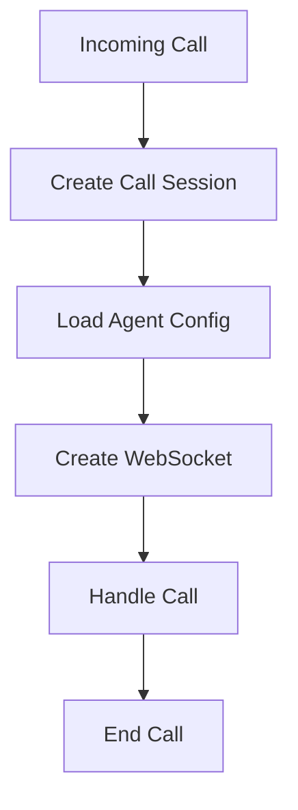

# Twilio OpenAI Voice Assistant - Multiple Call Handling

## Overview
The system handles multiple concurrent calls by maintaining separate sessions and configurations for each call. Here's how it works:

## Core Components

### 1. Call Session Management
- Each call has its own session stored in `CallSessionService`
- Sessions contain:
  ```typescript
  {
    streamSid: string;      // WebSocket stream identifier
    callSid: string;        // Twilio call identifier
    agentId: string;        // AI agent configuration ID
    fromNumber: string;     // Caller's number
    toNumber: string;       // Called number
    startTime: Date;        // When call started
    endTime?: Date;         // When call ended (if completed)
  }
  ```

### 2. Call Flow



1. **Call Reception**
   - Receive call to a Twilio number
   - Extract callSid, fromNumber, toNumber
   - Find corresponding agentId for toNumber
   - Create new session

2. **WebSocket Setup**
   - Create dedicated WebSocket for the call
   - Link streamSid with callSid
   - Initialize OpenAI connection

3. **During Call**
   Each call maintains its own:
   - WebSocket connection
   - OpenAI session
   - Configuration settings
   - Function executor context

4. **Call Termination**
   - Clean up session
   - Close WebSocket connections
   - Record end time

### 3. Example Multi-Call Scenario

```
Call 1: +1234 → Agent A
├── Session #1
├── WebSocket #1
└── OpenAI Connection #1

Call 2: +5678 → Agent B
├── Session #2
├── WebSocket #2
└── OpenAI Connection #2

(Both operate independently)
```

### 4. Key Services

1. **CallSessionService**
   - Manages active call sessions
   - Maps streamSid to callSid
   - Handles session lifecycle

2. **TwilioOpenaiService**
   - Handles WebSocket connections
   - Manages OpenAI interactions
   - Processes audio streams

3. **TwilioPhoneService**
   - Maps phone numbers to agent IDs
   - Validates incoming calls

### 5. Error Handling

- Invalid phone numbers return error TwiML
- Lost connections are detected and cleaned up
- Each call's errors are isolated from others

## Benefits
- Complete isolation between calls
- No shared state between sessions
- Scalable to multiple concurrent calls
- Clear session lifecycle management
- Easy debugging per call